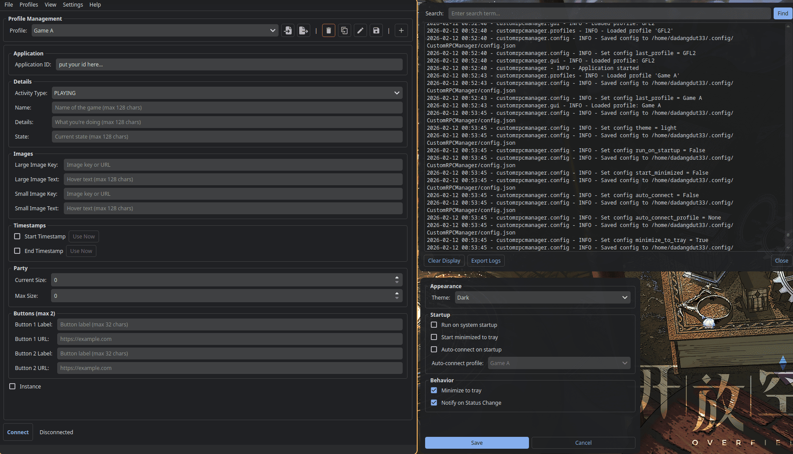
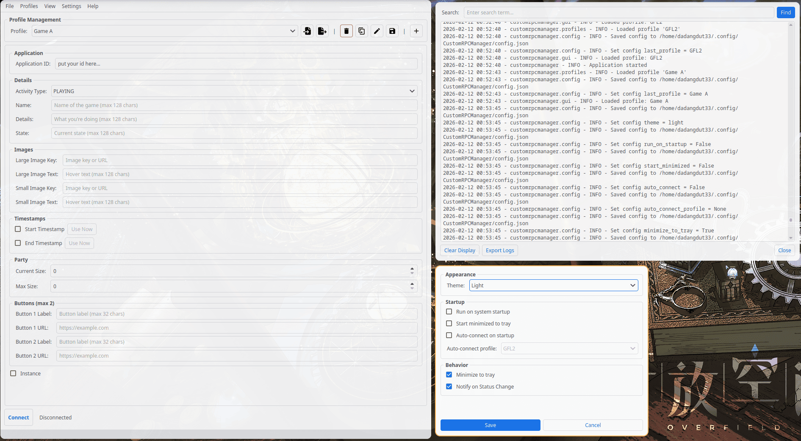

# CustomRPC Manager

A simple, cross-platform (i hope so, i have only tested it on linux) Discord Rich Presence manager that lets you manually control your Discord status without relying on process detection.

It can be launched from the terminal as headless / tray app, so you can run it as a pre-hook and post-hook in your game launch settings. Example:

```bash
# connect
customrpcmanager --profile "My Game" --connect
# disconnect
customrpcmanager --disconnect
```

## Preview

| Feature                                | Screenshots                                                                           |
| -------------------------------------- | ------------------------------------------------------------------------------------- |
| **Full Preview in linux (dark mode)**  |  <br /> |
| **Full Preview in linux (light mode)** |  |

## Features

- **Cross-Platform**: Works on Linux, Windows, and macOS. (i have only tested it on linux)
- **GUI Interface**: PyQt6-based interface with dark/light themes
- **CLI Support**: Headless control via command-line interface
- **System Tray**: Full system tray integration with background operation
- **Profile Management**: Create, edit, and manage RPC profiles
- **Autostart**: Optional run-on-startup with OS-specific implementation
- **Auto-Connect**: Automatically connect with a profile on startup
- **Log Viewer**: Built-in log viewer with search and export
- **Import/Export**: Share profiles via JSON import/export

## Requirements

- Python 3.10 or higher
- Discord Desktop Application running

## Installation / Download

First you need to Create a Discord Application by doing this:

1. Go to [https://discord.com/developers/applications](https://discord.com/developers/applications)
2. Click "New Application"
3. Name your application anything you want (this does not matter as it can be overriden by the app)
4. Copy the Application ID (you'll need this)

To install this app easily, you can use [pipx](https://github.com/pypa/pipx) or compile it manually.

### Using pipx to install

```bash
pipx install git+https://github.com/Dadangdut33/discord-customrpc-manager --pip-args="--ignore-requires-python"
```

### Manual

#### 1. Clone or Download

```bash
git clone https://github.com/Dadangdut33/discord-customrpc-manager
cd discord-customrpc-manager
```

#### 2. Install Dependencies

Use uv to install dependencies:

```bash
uv sync
```

Or manually:

```bash
pip install PyQt6 pypresence pyqtdarktheme qtawesome --ignore-requires-python
```

## Usage ❓

### Launching the App

If you install from pipx, you can run the application by typing `customrpcmanager` in your terminal. If you want to be able to run the app from your launcher, you can create a shortcut to the executable in your OS application directory. This would be in:

- Linux: `~/.local/share/applications/`
- Windows: `%APPDATA%/Microsoft/Windows/Start Menu/Programs/`
- macOS: `~/Applications/`

If you install manually (as in the git clone way), you can run the application by typing `python main.py` in your terminal.

#### Creating a Profile

1. Click New Profile Button
2. Enter a profile name
3. Fill in the Application ID (from Discord Developer Portal)
4. Fill in desired RPC fields (all optional except App ID)
5. Click **Save**

#### Connecting to Discord

1. Select a profile from the dropdown
2. Click **Connect**
3. Your Discord status will update immediately

### CLI Mode

The CLI allows headless control of the application.

#### Help

```bash
python main.py --help # or -h
```

#### List Profiles

```bash
python main.py --list-profiles
```

#### Load and Connect with Profile

```bash
python main.py --profile "Gaming" --connect
```

#### Disconnect

```bash
python main.py --disconnect
```

#### Quit

```bash
python main.py --quit
```

**Note**: CLI commands will control the running instance if one exists, otherwise start a new instance in headless mode (tray only, no window).

## RPC Fields Reference

For more detailed information take a look at [pypresence's docs](https://qwertyquerty.github.io/pypresence/html/doc/presence.html)

| Field                | Description                                                         | Example               |
| -------------------- | ------------------------------------------------------------------- | --------------------- |
| **Application ID**   | Discord Application ID (required)                                   | `1234567890123456789` |
| **Name**             | Name of the game / activity                                         | `Game X`              |
| **Details**          | what the player is currently doing                                  | `Playing Solo`        |
| **State**            | the user’s current status                                           | `In Menu`             |
| **Large Image Key**  | Asset key or URL for large image                                    | `main_logo`           |
| **Large Image Text** | Hover text for large image                                          | `Main Screen`         |
| **Small Image Key**  | Asset key or URL for small image                                    | `status_icon`         |
| **Small Image Text** | Hover text for small image                                          | `Online`              |
| **Start Timestamp**  | epoch time for game start (in milliseconds)                         | Click "Use Now"       |
| **End Timestamp**    | epoch time for game end (in milliseconds)                           | Click "Use Now"       |
| **Party Size**       | Current party size                                                  | `2`                   |
| **Party Max**        | Maximum party size                                                  | `4`                   |
| **Button 1/2 Label** | Button text (max 2 buttons)                                         | `Click me`            |
| **Button 1/2 URL**   | Button link                                                         | `https://example.com` |
| **Instance**         | marks the match as a game session with a specific beginning and end | Checkbox              |

## Configuration Locations

Configuration files are stored in OS-specific locations:

- **Linux**: `~/.config/CustomRPCManager/`
- **Windows**: `%APPDATA%/CustomRPCManager/`
- **macOS**: `~/Library/Application Support/CustomRPCManager/`

Directory structure:

```
customrpc/
├── config.json          # Application settings
├── profiles/            # Profile JSON files
│   ├── game_a.json
│   └── game_b.json
└── logs/                # Application logs
    └── customrpcmanager.log
```

## Autostart Setup

Enable in **Settings** > **Preferences** > **Run on system startup**.

The application will:

- **Linux**: Create `.desktop` file in `~/.config/autostart/`
- **Windows**: Add registry entry in `HKEY_CURRENT_USER\Software\Microsoft\Windows\CurrentVersion\Run`
- **macOS**: Create LaunchAgent plist in `~/Library/LaunchAgents/`

## Profile JSON Format

Profiles are stored as JSON files. Example:

```json
{
  "name": "Example Profile",
  "app_id": "1234567890123456789",
  "game_name": "Example Game",
  "details": "Playing a game",
  "state": "In a match",
  "start_timestamp": 1612345678,
  "end_timestamp": null,
  "large_image_key": "large_image",
  "large_image_text": "Main game",
  "small_image_key": "small_image",
  "small_image_text": "Status icon",
  "party_size": 2,
  "party_max": 4,
  "buttons": [
    {
      "label": "Website",
      "url": "https://example.com"
    },
    {
      "label": "Join Server",
      "url": "https://discord.gg/example"
    }
  ],
  "instance": true,
  "created_at": "2024-02-04T12:00:00",
  "updated_at": "2024-02-04T12:00:00"
}
```

## Disclaimer

For transparency, this project is made mostly with the help of using Google Antigravity (These AI agents are getting good fr). But I still check the code and debug manually.
